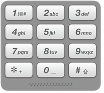
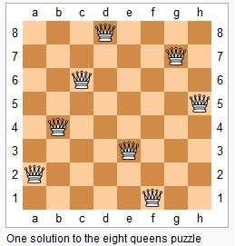

## 回溯算法

[17.电话号码的字母组合](#17电话号码的字母组合)

[22.括号生成](#22括号生成)

[39.组合总和](#39组合总和)

[40.组合总和Ⅱ](#40组合总和Ⅱ)

[46.全排列](#46全排列)

[47.全排列Ⅱ](#47全排列Ⅱ)

[51.N皇后](#51N皇后)

[78.子集](#78子集)

[90.子集Ⅱ](#90子集Ⅱ)

#### 17.电话号码的字母组合

给定一个仅包含数字 `2-9` 的字符串，返回所有它能表示的字母组合。给出数字到字母的映射如下（与电话按键相同）。注意 1 不对应任何字母。



**示例:**

```xml
输入："23"
输出：["ad", "ae", "af", "bd", "be", "bf", "cd", "ce", "cf"].
```

```java
class Solution {
    public List<String> letterCombinations(String digits) {
        List<String> ans = new ArrayList<>();
        if(digits.length() != 0){
            back(digits,"",ans);
        }
        return ans;
    }

    Map<String,String> map = new HashMap<String , String>(){{
        put("2","abc");
        put("3","def");
        put("4","ghi");
        put("5","jkl");
        put("6","mno");
        put("7","pqrs");
        put("8","tuv");
        put("9","wxyz");
    }};
    
    public void back(String next , String s ,List<String> ans){
        if(next.length() == 0){
            ans.add(s);
        }else{
            String digit = next.substring(0,1);
            String letters = map.get(digit);
            for(int i = 0;i<letters.length() ; i++){
               String letter = letters.substring(i,i+1);
               back(next.substring(1),s+letter ,ans);
            }
        }
    }

}
```


#### 22.括号生成

给出 *n* 代表生成括号的对数，请你写出一个函数，使其能够生成所有可能的并且**有效的**括号组合。

例如，给出 n = 3，生成结果为：

```xml
[
  "((()))",
  "(()())",
  "(())()",
  "()(())",
  "()()()"
]
```

```java
class Solution {
    public List<String> generateParenthesis(int n) {
        List<String> ans = new ArrayList<>();
        if(n==0){
            ans.add("");
        }else{
            for(int i = 0 ; i < n ;i++){
                for(String left : generateParenthesis(i)){
                    for(String right : generateParenthesis(n-1-i)){
                        ans.add("("+left+")"+right);
                    }
                }
            }
        }
        return ans;
    }

}
```


#### 39.组合总和

给定一个无重复元素的数组 candidates 和一个目标数 target ，找出 candidates 中所有可以使数字和为 target 的组合。

candidates 中的数字可以无限制重复被选取。

说明：

* 所有数字（包括 target）都是正整数。
* 解集不能包含重复的组合。 

示例 1:

```xml
输入: candidates = [2,3,6,7], target = 7,
所求解集为:
[
  [7],
  [2,2,3]
]
```

示例 2:

```xml
输入: candidates = [2,3,5], target = 8,
所求解集为:
[
  [2,2,2,2],
  [2,3,3],
  [3,5]
]
```

```java
class Solution {
    public List<List<Integer>> combinationSum(int[] candidates, int target) {
        List<List<Integer>> lists = new ArrayList<>();
        List<Integer> list = new ArrayList<>();
        backtrack(0 , candidates , list , lists , target );
        return lists;
    }

    public void backtrack(int index , int[] candidates , List<Integer> list , List<List<Integer>> lists , int target ){
        if(target < 0){
            return;
        }
        if(target == 0){
            lists.add(new ArrayList<>(list));
        }else{
            for(int i = index ; i < candidates.length ; i++){
                list.add(candidates[i]);
                backtrack(i , candidates , list , lists , target - candidates[i]);
                list.remove(list.size()-1);
            }
        }
    }
}
```


#### 40.组合总和Ⅱ

给定一个数组 `candidates` 和一个目标数 `target` ，找出 `candidates` 中所有可以使数字和为 `target` 的组合。

`candidates` 中的每个数字在每个组合中只能使用一次。

说明：

* 所有数字（包括目标数）都是正整数。
* 解集不能包含重复的组合。 

示例 1:

``` java
输入: candidates = [10,1,2,7,6,1,5], target = 8,
所求解集为:
[
  [1, 7],
  [1, 2, 5],
  [2, 6],
  [1, 1, 6]
]
```

示例 2:

```java
输入: candidates = [2,5,2,1,2], target = 5,
所求解集为:
[
  [1,2,2],
  [5]
]
```

```java
class Solution {
    public List<List<Integer>> combinationSum2(int[] candidates, int target) {
        // if(candidates == null || candidates.length == 0 || target < 0){
        //     return null;
        // }
        List<List<Integer>> lists = new ArrayList<>();
        List<Integer> list = new ArrayList<>();
        Arrays.sort(candidates);
        backtrack(0 , candidates , list , lists , target);
        return  lists;
    }

    public void backtrack(int index , int[] candidates , List<Integer> list , List<List<Integer>> lists , int target){
        if(target < 0){
            return;
        }
        if(target == 0){
            lists.add(new ArrayList<>(list));
        }else{
            //这层循环是遍历每一个数组中的数字作为头结点
            for(int i = index ; i < candidates.length ; i++){
                //排序后去重
                if(i > index && candidates[i-1] == candidates[i]){
                    continue;
                }
                list.add(candidates[i]);
                //递归遍历后面的数字,判断是否符合目标值
                backtrack(i+1 , candidates , list , lists , target - candidates[i]);
                list.remove(list.size() - 1);
            }
            
            
        }
    }
}
```


#### 46.全排列

给定一个**没有重复**数字的序列，返回其所有可能的全排列。

示例

```xml
输入: [1,2,3]
输出:
[
  [1,2,3],
  [1,3,2],
  [2,1,3],
  [2,3,1],
  [3,1,2],
  [3,2,1]
]
```

```java
class Solution {
    public List<List<Integer>> permute(int[] nums) {
        List<List<Integer>> lists = new ArrayList<>();
        if(nums == null || nums.length == 0){
            return lists;
        }
        List<Integer> list = new ArrayList<>();
        backtract(lists, list , nums );
        return lists;
    }

    public void backtract(List<List<Integer>> lists , List<Integer> list , int[] nums){
        if(list.size() == nums.length){
            lists.add(new ArrayList(list));
            return;
        }else{
            for(int num : nums){
                if(list.contains(num)){
                    continue;
                }
                list.add(num);
                backtract(lists , list , nums);
                list.remove(list.size() - 1);
            }
        }
    }
}
```


#### 47.全排列Ⅱ

给定一个可包含重复数字的序列，返回所有不重复的全排列。

**示例:**

```xml
输入: [1,1,2]
输出:
[
  [1,1,2],
  [1,2,1],
  [2,1,1]
]
```

```java
class Solution {
    public List<List<Integer>> permuteUnique(int[] nums) {
        List<List<Integer>> lists = new ArrayList<>();
        boolean[] used = new boolean[nums.length];
        if(nums.length == 0){
            return lists;
        }
        Arrays.sort(nums);
        
        List<Integer> list = new ArrayList<>();
        backtract(nums , list , lists ,used);
        return lists;
    }

    public void backtract(int[] nums , List<Integer> list , List<List<Integer>> lists , boolean[] used){
        if(list.size() == nums.length){
            lists.add(new ArrayList(list));
            return;
        }
        for(int i = 0 ; i < nums.length ; i++){
            if(!used[i]){
                //如果这个数和前一个数相同,且前一个数没有被使用(即现在这个数会和之前一个数产生的分支一样),则跳过
                if(i>0 && nums[i] == nums[i-1] && !used[i-1]){
                    continue;
                }
                used[i] = true;
                list.add(nums[i]);
                backtract(nums , list , lists , used);
                list.remove(list.size()-1);
                used[i] = false;
            }
        }
        
    }
}
```


#### 51.N皇后

*n* 皇后问题研究的是如何将 *n* 个皇后放置在 *n*×*n* 的棋盘上，并且使皇后彼此之间不能相互攻击。



给定一个整数 n，返回所有不同的 n 皇后问题的解决方案。

每一种解法包含一个明确的 n 皇后问题的棋子放置方案，该方案中 'Q' 和 '.' 分别代表了皇后和空位。

示例

```xml
输入: 4
输出: [
 [".Q..",  // 解法 1
  "...Q",
  "Q...",
  "..Q."],

 ["..Q.",  // 解法 2
  "Q...",
  "...Q",
  ".Q.."]
]
解释: 4 皇后问题存在两个不同的解法。
```

```java
class Solution {
    public List<List<String>> solveNQueens(int n) {
        String[][] board = new String[n][n];
        for (int i = 0; i < board.length; i++) {
            for (int j = 0; j < board[i].length; j++) {
                board[i][j] = ".";
            }
        }
        List<List<String>> ans = new ArrayList<>();
        backtrack(0, board ,ans);
        return ans;
    }

    private static void backtrack(int row,String[][] board , List<List<String>> ans){
        if(row == board.length){
            List<String> list = new ArrayList<>();
            for(int i = 0 ; i < board.length ; i++){
                StringBuilder sb = new StringBuilder();
                for(int j = 0; j < board[i].length; j++){
                    sb.append(board[i][j]); 
                }
                list.add(sb.toString());
            }
            ans.add(list);
        }else{
            for(int col = 0 ; col < board.length ;col++){
                if(!isValid(board,row,col)){
                    continue;
                }
                board[row][col]="Q";
                backtrack(row+1,board,ans);
                board[row][col]=".";
            }
        }
    }

    private static boolean isValid(String[][] board , int row ,int col){
        for(int i = 0 ; i < board.length ;i++){
            if(board[i][col] == "Q"){
                return false;
            }
        }
        for(int i = row-1,j = col+1 ; i>=0 && j<board.length ;i--,j++){
            if(board[i][j] == "Q"){
                return false;
            }
        }
        for(int i = row-1,j = col-1 ; i>=0 && j>=0 ;i--,j--){
            if(board[i][j] == "Q"){
                return false;
            }
        }
        return true;
    }
}
```


#### 78.子集

给定一组不含重复元素的整数数组 nums，返回该数组所有可能的子集（幂集）。

说明：解集不能包含重复的子集。

示例:

```xml
输入: nums = [1,2,3]
输出:
[
  [3],
  [1],
  [2],
  [1,2,3],
  [1,3],
  [2,3],
  [1,2],
  []
]
```

```java
class Solution {
    public List<List<Integer>> subsets(int[] nums) {
        List<List<Integer>> lists = new ArrayList<>();
        if (nums== null || nums.length == 0) {
            return lists;
        }
        List<Integer> list = new ArrayList<>();
        backtrack(0 , nums , lists , list);
        return lists;
    }

    private void backtrack(int i , int[] nums , List<List<Integer>> lists , List<Integer> list) {
        lists.add(new ArrayList<>(list));
        for (int j = i ; j < nums.length ; j++) {
            list.add(nums[j]);
            backtrack(j+1 , nums , lists , list);
            list.remove(list.size() - 1);
        }
    }
}
```


#### 90.子集Ⅱ

给定一个可能包含重复元素的整数数组 nums，返回该数组所有可能的子集（幂集）。

说明：解集不能包含重复的子集。

示例:

```xml
输入: [1,2,2]
输出:
[
  [2],
  [1],
  [1,2,2],
  [2,2],
  [1,2],
  []
]
```

```java
class Solution {
    public List<List<Integer>> subsetsWithDup(int[] nums) {
      List<List<Integer>> lists = new ArrayList<>();
        if (nums== null || nums.length == 0) {
            return lists;
        }
        List<Integer> list = new ArrayList<>();
        Arrays.sort(nums);
        backtrack(0 , nums , lists , list);
        return lists;
    }

    private void backtrack(int i , int[] nums , List<List<Integer>> lists , List<Integer> list) {
        lists.add(new ArrayList<>(list));
        for (int j = i ; j < nums.length ; j++) {
            //排序后去重
            if (j > i && nums[j-1] == nums[j]) {
                continue;
            }
            list.add(nums[j]);
            backtrack(j+1 , nums , lists , list);
            list.remove(list.size() - 1);
        }
    }
}
```


